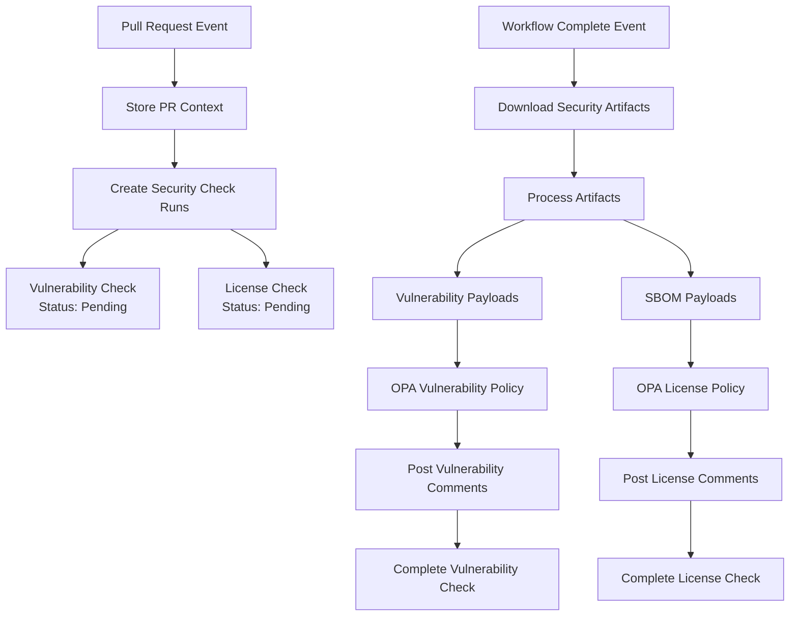

# Check Run Flow Documentation

## Overview

Polly implements a **dual-track security validation system** where vulnerability and license checks operate independently but in parallel. Each pull request receives two separate GitHub status checks:

- **Vulnerability Check Run** - Analyzes security vulnerabilities using Trivy reports
- **License Check Run** - Analyzes license compliance using SPDX SBOM files

## Flow Architecture



## Detailed Flow Sequence

### 1. Pull Request Events

**Trigger**: PR opened/reopened webhook
**Handler**: `WebhookRouter → PullRequestHandler.HandlePullRequestEvent()`

```go
// Sequence
PR Event → Store PR Context → SecurityCheckManager.CreateSecurityCheckRuns() → Set Status: Pending
```

**What happens:**
1. **Store PR Context**: Maps SHA → PR number in `prContextStore` for later lookup
2. **Security Check Creation**: `SecurityCheckManager.CreateSecurityCheckRuns()` handles the creation process
3. **Get Check Types**: Calls `getSecurityCheckTypes()` to define vulnerability and license check configurations
4. **Create Check Runs Concurrently**:
   - Creates vulnerability check run via `CreateVulnerabilityCheck()`
   - Creates license check run via `CreateLicenseCheck()`
   - Starts both checks in "pending" state
   - Stores check run IDs in `vulnerabilityCheckStore` and `licenseCheckStore`

**Code Location**: `PullRequestHandler.HandlePullRequestEvent()` in `webhook_pullrequest.go`

### 2. Workflow Events

#### 2a. Workflow Started

**Trigger**: Workflow `requested` or `in_progress` actions
**Handler**: `WebhookRouter → WorkflowHandler.handleWorkflowStarted()`

```go
// Updated Sequence (deduplicated)
Workflow Start → Check StateService for existing check IDs
    ├─ If exists → SecurityCheckManager.StartExistingSecurityChecksInProgress() (no new creation) → return
    └─ If not exists → Find PR Context → (optional fallback) CreateSecurityCheckRuns()
```

Deduplication: workflow_run no longer creates new checks if IDs already exist. It updates status to in_progress. This avoids duplicates created by both PR and workflow events.

#### 2b. Workflow Completed

**Trigger**: Workflow `completed` action
**Handler**: `WebhookRouter → WorkflowHandler.handleWorkflowCompleted()`

```go
// Sequence
Workflow Complete → Download Artifacts → Process Security Data → Complete Check Runs via Shared Processing Functions
```

**What happens:**
1. **Success Check**: Only processes workflows with `conclusion: "success"`
2. **Artifact Processing**: Downloads and analyzes workflow artifacts using `SecurityService`
3. **Content Detection**: Looks for:
   - Trivy JSON vulnerability reports
   - SPDX SBOM files
4. **Payload Creation**: Converts artifacts into `VulnerabilityPayload` and `SBOMPayload`
5. **Check Run Lookup**: Finds existing check runs using stored IDs
6. **Policy Evaluation**: Calls `WorkflowHandler.processSecurityPayloads()` for evaluation

**Code Location**: `WorkflowHandler.handleWorkflowCompleted()` in `webhook_workflow.go`

Telemetry: All phases use `TelemetryHelper` (replaced deprecated TracingHelper) for span creation & error recording.

### 3. Security Payload Processing

**Handler**: `WorkflowHandler.processSecurityPayloads()` with shared processing functions

```go
// Sequence
Security Payloads → Concurrent Processing → Shared Processing Functions → Policy Evaluation → Comments → Check Completion
```

**Vulnerability Processing** (if vulnerability check run exists):
1. **Shared Processing**: Uses `helpers.processVulnerabilityChecks()` function
2. **Policy Evaluation**: Evaluates vulnerabilities against OPA policies via `CheckVulnerabilityPolicy()`
3. **Comment Generation**: Posts PR comments for violations using `buildVulnerabilityViolationComment()`
4. **Check Completion**: Completes vulnerability check run with success/failure status

**License Processing** (if license check run exists):
1. **Shared Processing**: Uses `helpers.processLicenseChecks()` function
2. **Policy Evaluation**: Evaluates SBOM against OPA policies via `CheckSBOMPolicy()`
3. **Comment Generation**: Posts PR comments for violations using `buildLicenseComment()`
3. **Check Completion**: Completes license check run with success/failure status

**Concurrency**: Both processes run concurrently using `utils.ExecuteConcurrently()`

**Code Location**: Lines 600-680 in `webhook.go`

### 4. Failure Scenarios

**Handler**: `completeSecurityChecksAsNeutral()`

```go
// Sequence
Workflow Failed/No Artifacts → Complete as Neutral → Both Checks: Status = Neutral
```

**When triggered:**
- Workflow fails (`conclusion != "success"`)
- No artifacts found
- Security artifact processing fails

**What happens:**
- Both vulnerability and license check runs are completed with "neutral" status
- Uses concurrent processing via `utils.ExecuteConcurrently()`

**Code Location**: Lines 450-470 in `webhook.go`

## Key Data Structures

### Storage Maps

```go
type WebhookHandler struct {
    // SHA → PR number mapping
    prContextStore map[string]int64

    // SHA → check run ID mappings
    vulnerabilityCheckStore map[string]int64
    licenseCheckStore       map[string]int64

    // Thread-safe access
    prContextMutex          sync.RWMutex
    vulnerabilityCheckMutex sync.RWMutex
    licenseCheckMutex       sync.RWMutex
}
```

### Security Check Types

```go
type SecurityCheckType struct {
    name   string                                    // "vulnerability" | "license"
    create func() (*gogithub.CheckRun, error)       // Creates check run
    start  func(checkRunID int64) error             // Starts check run
    store  func(checkRunID int64)                   // Stores check run ID
}
```

### Check Run Types (in services)

```go
const (
    CheckRunTypeVulnerability CheckRunType = "Vulnerability Scan Check"
    CheckRunTypeLicense       CheckRunType = "License Check"
)
```

## Concurrency Patterns

The system uses `utils.ExecuteConcurrently()` for parallel processing:

1. **Check Creation**: Creates vulnerability and license checks concurrently
2. **Payload Processing**: Processes vulnerability and SBOM payloads concurrently
3. **Neutral Completion**: Completes both check types concurrently

```go
// Example usage
tasks := []func() error{
    func() error { return processVulnerabilityChecks(...) },
    func() error { return processLicenseChecks(...) },
}
errs := utils.ExecuteConcurrently(tasks)
```

## Event Handler Mapping

| GitHub Event | Action | Handler | Purpose |
|--------------|--------|---------|---------|
| `pull_request` | `opened`/`reopened`/`synchronize` | `handlePullRequestEvent()` | Create pending security checks (primary) |
| `workflow_run` | `requested`/`in_progress` | `handleWorkflowStarted()` | Mark existing checks in_progress; optional fallback create for push-only |
| `workflow_run` | `completed` | `handleWorkflowCompleted()` | Process artifacts and complete checks |
| `check_run` | `rerequested` | `handleCheckRunEvent()` | Handle check reruns |
| `check_suite` | `requested` | `HandleCheckSuite()` | Store suite ID, orchestrate workflow (no check creation) |
| `check_suite` | `rerequested` | `HandleCheckSuite()` | Re-run existing checks via stored IDs |

## Security Artifact Types

### Vulnerability Artifacts
- **Source**: Trivy security scanner
- **Format**: JSON vulnerability reports
- **Processing**: Converted to `VulnerabilityPayload`
- **Policy Path**: `/v1/data/compliance/vulnerability_report`

### License Artifacts
- **Source**: SPDX SBOM generators
- **Format**: SPDX JSON files
- **Processing**: Converted to `SBOMPayload`
- **Policy Path**: `/v1/data/compliance/license_report`

## Current Issues & Limitations

### 1. Redundant Check Creation
**Problem**: Both PR events and workflow events create check runs, resulting in duplicates.

**Code**:
- `handlePullRequestEvent()` creates checks (Lines 216-260)
- `handleWorkflowStarted()` creates checks (Lines 295-320)

**Solution**: Choose one event type for check creation.

### 2. No Check Run Restart
**Problem**: `handleCheckRunEvent()` doesn't restart individual checks when rerequested.

**Code**: Lines 262-290 in `webhook.go`

**Current Behavior**: Logs and skips rerun requests

**Solution**: Implement logic to determine check type and restart appropriately.

### 3. Missing Validation
**Problem**: No validation that security services are properly configured.

**Solution**: Add health checks for OPA connectivity and GitHub API access.

## Configuration Dependencies

### Required Services
1. **OPA Server**: Must be accessible for policy evaluation
2. **GitHub API**: Must have check run and comment permissions
3. **Workflow Artifacts**: Must be accessible for download

### Required Permissions
- `checks:write` - Create and update check runs
- `pull_requests:write` - Post comments on PRs
- `actions:read` - Access workflow artifacts

## Future Enhancements

### 1. Smart Check Run Management
- Eliminate redundant check creation
- Implement intelligent rerun handling
- Add check run deduplication

### 2. Enhanced Error Handling
- Graceful degradation when services unavailable
- Retry mechanisms for transient failures
- Better error reporting in check runs

### 3. Performance Optimizations
- Parallel artifact processing
- Cached policy evaluations
- Optimized comment generation

## Troubleshooting

### Common Issues

**Check runs not appearing:**
- Verify GitHub app permissions include `checks:write`
- Check webhook event delivery in GitHub app settings
- Verify OPA server connectivity

**Artifacts not processing:**
- Ensure workflow generates Trivy JSON and/or SPDX files
- Check artifact names match expected patterns
- Verify workflow completes successfully

**Policy evaluation failing:**
- Verify OPA server is accessible
- Check policy bundle is loaded correctly
- Review OPA logs for evaluation errors

### Debug Logging

Enable debug logging to trace the flow:

```go
h.logger.DebugContext(ctx, "Processing vulnerability payload",
    "payload_vulnerability_summary", payload.Summary,
)
```

Key log messages to monitor:
- "Creating security check runs for pull request"
- "Processing workflow security artifacts"
- "Processing security payloads"
- "Found security check run for SHA"
