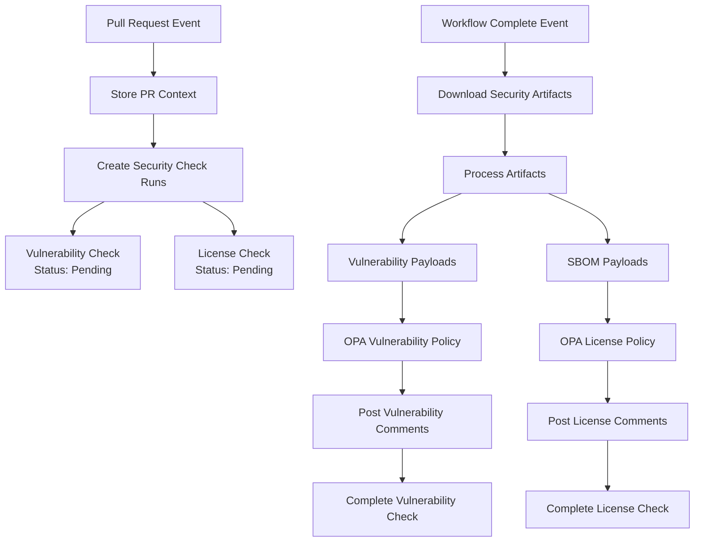

# Check Run System Documentation

## Overview

Polly implements a **dual-track security validation system** where vulnerability and license checks operate independently but in parallel. Each pull request receives two separate GitHub status checks:

- **Vulnerability Check Run** - Analyzes security vulnerabilities using Trivy reports
- **License Check Run** - Analyzes license compliance using SPDX SBOM files

This system supports both initial validation and intelligent check reruns that reprocess existing artifacts with updated policies without requiring expensive CI pipeline re-execution.

## Architecture & Flow



## Detailed Flow Sequence

### 1. Pull Request Events

**Trigger**: PR opened/reopened webhook
**Handler**: `WebhookRouter → PullRequestHandler.HandlePullRequestEvent()`

```go
// Sequence
PR Event → Store PR Context → SecurityCheckManager.CreateSecurityCheckRuns() → Set Status: Pending
```

**What happens:**
1. **Store PR Context**: Maps SHA → PR number in `prContextStore` for later lookup
2. **Security Check Creation**: `SecurityCheckManager.CreateSecurityCheckRuns()` handles the creation process
3. **Get Check Types**: Calls `getSecurityCheckTypes()` to define vulnerability and license check configurations
4. **Create Check Runs Concurrently**:
   - Creates vulnerability check run via `CreateVulnerabilityCheck()`
   - Creates license check run via `CreateLicenseCheck()`
   - Starts both checks in "pending" state
   - Stores check run IDs in `vulnerabilityCheckStore` and `licenseCheckStore`

**Code Location**: `PullRequestHandler.HandlePullRequestEvent()` in `webhook_pullrequest.go`

### 2. Workflow Events

#### 2a. Workflow Started

**Trigger**: Workflow `requested` or `in_progress` actions
**Handler**: `WebhookRouter → WorkflowHandler.handleWorkflowStarted()`

```go
// Updated Sequence (deduplicated)
Workflow Start → Check StateService for existing check IDs
    ├─ If exists → SecurityCheckManager.StartExistingSecurityChecksInProgress() (no new creation) → return
    └─ If not exists → Find PR Context → (optional fallback) CreateSecurityCheckRuns()
```

Deduplication: workflow_run no longer creates new checks if IDs already exist. It updates status to in_progress. This avoids duplicates created by both PR and workflow events.

#### 2b. Workflow Completed

**Trigger**: Workflow `completed` action
**Handler**: `WebhookRouter → WorkflowHandler.handleWorkflowCompleted()`

```go
// Sequence
Workflow Complete → Download Artifacts → Process Security Data → Complete Check Runs via Shared Processing Functions
```

**What happens:**
1. **Success Check**: Only processes workflows with `conclusion: "success"`
2. **Artifact Processing**: Downloads and analyzes workflow artifacts using `SecurityService`
3. **Content Detection**: Looks for:
   - Trivy JSON vulnerability reports
   - SPDX SBOM files
4. **Payload Creation**: Converts artifacts into `VulnerabilityPayload` and `SBOMPayload`
5. **Check Run Lookup**: Finds existing check runs using stored IDs
6. **Policy Evaluation**: Calls `WorkflowHandler.processSecurityPayloads()` for evaluation
7. **Artifact Storage**: Stores workflow run ID for potential future reruns

**Code Location**: `WorkflowHandler.handleWorkflowCompleted()` in `webhook_workflow.go`

### 3. Security Payload Processing

**Handler**: `WorkflowHandler.processSecurityPayloads()` with shared processing functions

```go
// Sequence
Security Payloads → Concurrent Processing → Shared Processing Functions → Policy Evaluation → Comments → Check Completion
```

**Vulnerability Processing** (if vulnerability check run exists):
1. **Shared Processing**: Uses `helpers.processVulnerabilityChecks()` function
2. **Policy Evaluation**: Evaluates vulnerabilities against OPA policies via `CheckVulnerabilityPolicy()`
3. **Comment Generation**: Posts PR comments for violations using `buildVulnerabilityViolationComment()`
4. **Check Completion**: Completes vulnerability check run with success/failure status

**License Processing** (if license check run exists):
1. **Shared Processing**: Uses `helpers.processLicenseChecks()` function
2. **Policy Evaluation**: Evaluates SBOM against OPA policies via `CheckSBOMPolicy()`
3. **Comment Generation**: Posts PR comments for violations using `buildLicenseComment()`
4. **Check Completion**: Completes license check run with success/failure status

**Concurrency**: Both processes run concurrently using `utils.ExecuteConcurrently()`

### 4. Failure Scenarios

**Handler**: `completeSecurityChecksAsNeutral()`

```go
// Sequence
Workflow Failed/No Artifacts → Complete as Neutral → Both Checks: Status = Neutral
```

**When triggered:**
- Workflow fails (`conclusion != "success"`)
- No artifacts found
- Security artifact processing fails

**What happens:**
- Both vulnerability and license check runs are completed with "neutral" status
- Uses concurrent processing via `utils.ExecuteConcurrently()`

## Check Rerun System

> **Note**: As of the recent webhook refactoring, check run rerun functionality is handled by the `CheckRunHandler` in `webhook_checkrun.go`. The core functionality remains the same, but is now organized in a more modular structure.

### How Reruns Work

1. **Workflow Completion**: When a workflow completes successfully with artifacts:
   - The system stores the workflow run ID for the commit SHA via `WorkflowHandler`
   - Security artifacts are processed and check runs are completed using shared processing functions

2. **Check Run Event Reception**: When a user clicks "Re-run" on a check:
   - GitHub sends a `check_run` webhook with action `"rerequested"`
   - `WebhookRouter` dispatches to `CheckRunHandler.HandleCheckRunEvent()`

3. **Check Type Identification**: The handler examines the `check_run.name` field to determine the type:
   - Contains "Vulnerability" → Calls `CheckRunHandler.restartVulnerabilityCheck()`
   - Contains "License" → Calls `CheckRunHandler.restartLicenseCheck()`
   - Other → Unknown (logged and skipped)

4. **Context Restoration**:
   - Extracts PR context from the check run's `pull_requests` field
   - Stores the PR number for the SHA in the context store
   - Stores the check run ID in the appropriate check store (vulnerability or license)

5. **Artifact Lookup**:
   - Looks up the stored workflow run ID for the commit SHA
   - If found, processes the original artifacts from that workflow run
   - If not found, completes the check as "neutral" (no artifacts to analyze)

6. **Check Processing**:
   - Calls `ProcessWorkflowSecurityArtifacts()` with the stored workflow run ID
   - Re-evaluates the same security scan results with current policy using shared processing functions
   - Posts updated comments if violations are found using shared comment builders
   - Completes the check run with current results

### Artifact Storage System

The webhook handler maintains an in-memory store that maps SHA commits to workflow run IDs:

```go
artifactStore map[string]int64 // sha -> workflow_run_id
```

This enables the system to:
1. **Store Artifacts**: When a workflow completes successfully, store the workflow run ID for the commit SHA
2. **Retrieve Artifacts**: When a check is rerun, look up the original workflow run ID to access stored artifacts
3. **Process Historical Data**: Re-evaluate the same security scan results that were originally processed

### Supported Check Types

The system can identify and restart two types of security checks based on the check run name:

1. **Vulnerability Checks** - Any check run with "Vulnerability" in the name
2. **License Checks** - Any check run with "License" in the name

### Rerun Example Payload

Based on a typical payload, a "License Check" rerun would:

```json
{
  "action": "rerequested",
  "check_run": {
    "id": 45860128821,
    "name": "License Check",
    "head_sha": "d815b044b1560799e9016d5fc76dd3e4853ace11",
    "pull_requests": [
      {
        "number": 36
      }
    ]
  },
  "repository": {
    "owner": { "login": "terrpan" },
    "name": "test-repo"
  }
}
```

This would result in:
1. Identification as a license check
2. Storage of PR #36 context for SHA `d815b044b1560799e9016d5fc76dd3e4853ace11`
3. Storage of check run ID `45860128821` in the license check store
4. Lookup of stored workflow run ID for the SHA
5. Re-processing of SBOM artifacts from the original workflow run
6. Re-evaluation with current license policies
7. Updated check run completion with current results

## Complete Example Walkthrough

This section shows a complete example of how the check rerun functionality works in practice.

### Scenario

A developer creates a PR that initially passes security checks, but later the security policies are updated to be more strict. The developer wants to rerun the license check to see if their code still complies with the new policies.

### Step-by-Step Flow

#### 1. Initial Workflow Run (Day 1)

**PR Event**: Developer pushes commit `abc123` to PR #42

**Workflow Execution**:
```
Workflow "Security Scan" starts
├── Trivy vulnerability scan → creates vuln-report.json
├── SBOM generation → creates sbom.json
└── Workflow completes successfully (run ID: 556677)
```

**Webhook Processing**:
```
workflow_run event (action: completed, conclusion: success)
├── Store: sha "abc123" → workflow_run_id 556677
├── Process artifacts from workflow 556677
├── Create vulnerability check (ID: 111) → PASS
└── Create license check (ID: 222) → PASS
```

**Result**: Both checks pass, PR is ready to merge.

#### 2. Policy Update (Day 2)

Security team updates license policy to be more restrictive:
- Previously allowed: MIT, Apache-2.0, BSD-3-Clause
- Now allowed: MIT, Apache-2.0 only (BSD-3-Clause removed)

#### 3. Developer Reruns Check (Day 2)

Developer notices policy change and wants to verify compliance.

**GitHub UI**: Developer clicks "Re-run" on the "License Check"

**Webhook Received**:
```json
{
  "action": "rerequested",
  "check_run": {
    "id": 222,
    "name": "License Check",
    "head_sha": "abc123",
    "pull_requests": [{"number": 42}]
  }
}
```

**Webhook Processing**:
```
check_run event (action: rerequested)
├── Identify: "License Check" → license check type
├── Store: check_run_id 222 for sha "abc123"
├── Store: PR #42 context for sha "abc123"
├── Lookup: sha "abc123" → workflow_run_id 556677 ✓
├── Process stored artifacts from workflow 556677
├── Re-evaluate SBOM with NEW license policy
├── Find: 3 packages with BSD-3-Clause license (now non-compliant)
├── Post comment: "License violations found..."
└── Complete check: FAILURE
```

**Result**: License check now fails with the updated policy, showing which packages violate the new rules.

### Key Benefits Demonstrated

1. **No CI Re-run**: The original security scans (Trivy, SBOM) didn't need to run again
2. **Policy Updates**: New policies were applied to existing scan data
3. **Fast Feedback**: Results available in seconds, not minutes
4. **Accurate Results**: Same scan data ensures consistent baseline for comparison
5. **Detailed Feedback**: Updated comments show exactly which packages now violate policy

### Technical Details

**StateService Storage**:
```go
// After initial workflow
stateService.StoreWorkflowRunID(ctx, "abc123", 556677)
stateService.StorePRNumber(ctx, "abc123", 42)
stateService.StoreLicenseCheckRunID(ctx, "abc123", 222)

// During rerun
workflowRunID, _ := stateService.GetWorkflowRunID(ctx, "abc123")  // → 556677
prNumber, _ := stateService.GetPRNumber(ctx, "abc123")           // → 42
checkRunID, _ := stateService.GetLicenseCheckRunID(ctx, "abc123") // → 222
```

**Service Calls**:
```go
// Start the check in "in_progress" state
checkService.StartLicenseCheck(ctx, owner, repo, 222)

// Process original artifacts with current policies
securityService.ProcessWorkflowSecurityArtifacts(ctx, owner, repo, "abc123", 556677)

// Complete with new results
checkService.CompleteLicenseCheck(ctx, owner, repo, 222, "failure", result)
```

This approach provides immediate feedback on policy compliance without requiring expensive CI pipeline re-execution.

## Key Data Structures

### Storage Maps

```go
type WebhookHandler struct {
    // SHA → PR number mapping
    prContextStore map[string]int64

    // SHA → check run ID mappings
    vulnerabilityCheckStore map[string]int64
    licenseCheckStore       map[string]int64

    // SHA → workflow run ID mapping (for reruns)
    artifactStore map[string]int64

    // Thread-safe access
    prContextMutex          sync.RWMutex
    vulnerabilityCheckMutex sync.RWMutex
    licenseCheckMutex       sync.RWMutex
    artifactStoreMutex      sync.RWMutex
}
```

### Security Check Types

```go
type SecurityCheckType struct {
    name   string                                    // "vulnerability" | "license"
    create func() (*gogithub.CheckRun, error)       // Creates check run
    start  func(checkRunID int64) error             // Starts check run
    store  func(checkRunID int64)                   // Stores check run ID
}
```

### Check Run Types (in services)

```go
const (
    CheckRunTypeVulnerability CheckRunType = "Vulnerability Scan Check"
    CheckRunTypeLicense       CheckRunType = "License Check"
)
```

## Workflow Flows

### Initial Workflow Flow
```
PR Created/Updated
    ↓
Workflow Triggered → Security Scans → Artifacts Generated
    ↓                                       ↓
Check Runs Created ←←←←←←←←←←←← Artifacts Processed & Stored
    ↓                                       ↓
Check Results Posted             Workflow Run ID Stored (SHA → ID)
```

### Check Rerun Flow
```
User Clicks "Re-run"
    ↓
Check Run Webhook → Check Type Identified → Stored Workflow ID Retrieved
    ↓                                                ↓
Check Started → Original Artifacts Re-processed → Policies Re-evaluated
    ↓                                                ↓
New Comments Posted ←←←←←←←← Updated Check Results ←←←←←←←←
```

## Concurrency Patterns

The system uses `utils.ExecuteConcurrently()` for parallel processing:

1. **Check Creation**: Creates vulnerability and license checks concurrently
2. **Payload Processing**: Processes vulnerability and SBOM payloads concurrently
3. **Neutral Completion**: Completes both check types concurrently

```go
// Example usage
tasks := []func() error{
    func() error { return processVulnerabilityChecks(...) },
    func() error { return processLicenseChecks(...) },
}
errs := utils.ExecuteConcurrently(tasks)
```

## Event Handler Mapping

| GitHub Event | Action | Handler | Purpose |
|--------------|--------|---------|---------|
| `pull_request` | `opened`/`reopened`/`synchronize` | `handlePullRequestEvent()` | Create pending security checks (primary) |
| `workflow_run` | `requested`/`in_progress` | `handleWorkflowStarted()` | Mark existing checks in_progress; optional fallback create for push-only |
| `workflow_run` | `completed` | `handleWorkflowCompleted()` | Process artifacts and complete checks |
| `check_run` | `rerequested` | `handleCheckRunEvent()` | Handle check reruns |
| `check_suite` | `requested` | `HandleCheckSuite()` | Store suite ID, orchestrate workflow (no check creation) |
| `check_suite` | `rerequested` | `HandleCheckSuite()` | Re-run existing checks via stored IDs |

## Security Artifact Types

### Vulnerability Artifacts
- **Source**: Trivy security scanner
- **Format**: JSON vulnerability reports
- **Processing**: Converted to `VulnerabilityPayload`
- **Policy Path**: `/v1/data/compliance/vulnerability_report`

### License Artifacts
- **Source**: SPDX SBOM generators
- **Format**: SPDX JSON files
- **Processing**: Converted to `SBOMPayload`
- **Policy Path**: `/v1/data/compliance/license_report`

## Benefits of the Rerun System

- **Artifact Persistence**: Original security scan results are preserved and can be re-evaluated
- **Policy Updates**: Changes to security policies can be applied to existing scan results without re-running CI
- **Granular Control**: Users can rerun individual failed checks without rerunning the entire CI pipeline
- **Efficient Resource Usage**: Re-uses existing artifacts instead of regenerating security scans
- **Better User Experience**: Faster feedback loop for developers fixing security issues
- **Consistent Results**: Same scan data is used, ensuring consistent baseline for policy evaluation

## Testing

The implementation includes comprehensive tests covering:
- Action filtering (only `"rerequested"` actions are processed)
- Check type identification logic
- Context storage and retrieval
- Artifact storage and lookup functionality
- Error handling for unknown check types
- Error handling for missing artifacts

## Edge Cases Handled

- **No Stored Artifacts**: If no workflow run ID is found for a SHA, the check completes as "neutral"
- **Missing PR Context**: Checks can be processed without PR context (no comments posted)
- **Failed Artifact Processing**: If artifact retrieval fails, the check completes as "neutral"
- **Empty Artifacts**: If no security artifacts are found in the workflow run, check completes as "neutral"

## Configuration Dependencies

### Required Services
1. **OPA Server**: Must be accessible for policy evaluation
2. **GitHub API**: Must have check run and comment permissions
3. **Workflow Artifacts**: Must be accessible for download

### Required Permissions
- `checks:write` - Create and update check runs
- `pull_requests:write` - Post comments on PRs
- `actions:read` - Access workflow artifacts

## Current Issues & Limitations

### 1. Redundant Check Creation
**Problem**: Both PR events and workflow events create check runs, resulting in duplicates.

**Code**:
- `handlePullRequestEvent()` creates checks (Lines 216-260)
- `handleWorkflowStarted()` creates checks (Lines 295-320)

**Solution**: Choose one event type for check creation.

### 2. Missing Validation
**Problem**: No validation that security services are properly configured.

**Solution**: Add health checks for OPA connectivity and GitHub API access.

## Future Enhancements

### 1. Smart Check Run Management
- Eliminate redundant check creation
- Implement intelligent rerun handling
- Add check run deduplication

### 2. Enhanced Error Handling
- Graceful degradation when services unavailable
- Retry mechanisms for transient failures
- Better error reporting in check runs

### 3. Performance Optimizations
- Parallel artifact processing
- Cached policy evaluations
- Optimized comment generation

### 4. Additional Check Types
- Support for additional check types beyond vulnerability and license
- More sophisticated check name pattern matching
- Enhanced error handling and retry logic

## Troubleshooting

### Common Issues

**Check runs not appearing:**
- Verify GitHub app permissions include `checks:write`
- Check webhook event delivery in GitHub app settings
- Verify OPA server connectivity

**Artifacts not processing:**
- Ensure workflow generates Trivy JSON and/or SPDX files
- Check artifact names match expected patterns
- Verify workflow completes successfully

**Policy evaluation failing:**
- Verify OPA server is accessible
- Check policy bundle is loaded correctly
- Review OPA logs for evaluation errors

**Reruns not working:**
- Check that workflow run ID was stored for the SHA
- Verify artifacts are still available in GitHub
- Check logs for artifact processing errors

### Debug Logging

Enable debug logging to trace the flow:

```go
h.logger.DebugContext(ctx, "Processing vulnerability payload",
    "payload_vulnerability_summary", payload.Summary,
)
```

Key log messages to monitor:
- "Creating security check runs for pull request"
- "Processing workflow security artifacts"
- "Processing security payloads"
- "Found security check run for SHA"
- "Rerunning security check"
- "Found stored workflow run ID for rerun"
