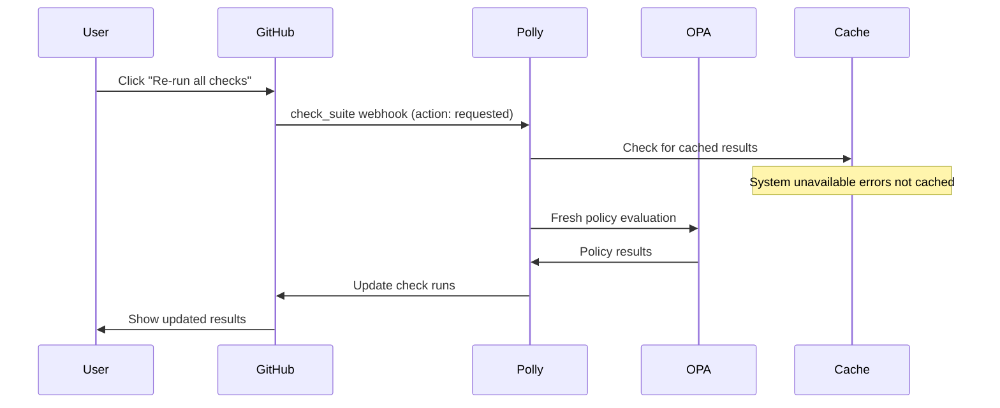

# Check Suite Webhook Implementation Guide

## Overview

This document outlines the implementation of GitHub `check_suite` webhook support in Polly to enable users to retry policy evaluations when OPA becomes available again after an outage.

## Problem Statement

When OPA (Open Policy Agent) is unavailable, Polly correctly returns "neutral" check conclusions instead of false policy failures. However, users had no clear way to retry policy evaluation once OPA came back online, leading to poor user experience during system recovery.

## Solution Architecture

### Core Components

```
GitHub UI "Re-run checks" → check_suite webhook → CheckSuiteWebhookHandler → SecurityService → Fresh Policy Evaluation
```

### Key Files

- `internal/handlers/webhook_checksuite.go` - Main handler implementation
- `internal/handlers/webhook_checksuite_test.go` - Test suite
- `internal/handlers/webhook.go` - Router integration

## Implementation Details

### 1. Event Handler Structure

Following Polly's webhook handler pattern:

```go
type CheckSuiteWebhookHandler struct {
    *BaseWebhookHandler
    securityService services.SecurityServiceInterface
    stateService    services.StateServiceInterface
}
```

### 2. Supported Actions

| Action | Trigger | Behavior |
|--------|---------|----------|
| `requested` | User clicks "Re-run all checks" | Re-evaluate all policies |
| `rerequested` | User clicks "Re-run failed checks" | Re-evaluate all policies |
| `completed` | All checks in suite finish | Log completion (future: summary) |

### 3. Integration with Cache Fix

The implementation leverages the cache fix that prevents `ErrSystemUnavailable` from being cached:

1. User requests check suite re-run
2. Handler calls `SecurityService.ProcessWorkflowArtifacts()`
3. Policy evaluation bypasses cached system errors
4. Fresh OPA evaluation attempted
5. Results posted as new check runs

## Data Flow



## Code Structure

### Handler Implementation

```go
func (h *CheckSuiteWebhookHandler) HandleCheckSuite(ctx context.Context, event *github.CheckSuiteEvent) error {
    switch *event.Action {
    case "requested", "rerequested":
        return h.handleCheckSuiteRerun(ctx, event)
    case "completed":
        return h.handleCheckSuiteCompleted(ctx, event)
    default:
        // Ignore other actions
        return nil
    }
}
```

### Re-run Logic

```go
func (h *CheckSuiteWebhookHandler) handleCheckSuiteRerun(ctx context.Context, event *github.CheckSuiteEvent) error {
    // Extract repository and SHA information
    owner := event.Repo.Owner.GetLogin()
    repo := event.Repo.GetName()
    sha := event.CheckSuite.GetHeadSHA()

    // Find associated workflow
    workflowID, err := h.stateService.GetWorkflowID(ctx, owner, repo, sha)
    if err != nil {
        // Not an error - might be for other apps
        return nil
    }

    // Trigger fresh policy evaluation
    return h.securityService.ProcessWorkflowArtifacts(ctx, owner, repo, sha, workflowID)
}
```

## Testing Strategy

### Test Structure

Following Polly's testing patterns with testify suites:

```go
type CheckSuiteWebhookTestSuite struct {
    WebhookTestSuite
    handler *CheckSuiteWebhookHandler
}
```

### Test Coverage

- ✅ Handle `requested` action with existing workflow
- ✅ Handle `rerequested` action
- ✅ Ignore unknown actions
- ✅ Handle missing workflow gracefully
- ✅ Integration with mock services

### Test Data

```go
const (
    testCheckSuiteEventJSON = `{
        "action": "requested",
        "check_suite": {
            "head_sha": "test-sha-123"
        },
        "repository": {
            "name": "test-repo",
            "owner": {
                "login": "test-owner"
            }
        }
    }`
)
```

## Integration Points

### 1. Webhook Router Updates

```go
// internal/handlers/webhook.go
func (h *WebhookHandler) HandleWebhook(ctx context.Context, eventType string, payload []byte) error {
    switch eventType {
    case "check_suite":
        return h.handleCheckSuiteEvent(ctx, payload)
    // ... other cases
    }
}
```

### 2. Dependency Injection

```go
// internal/app/container.go
checkSuiteHandler := handlers.NewCheckSuiteWebhookHandler(
    baseHandler,
    securityService,
    stateService,
)
```

### 3. State Service Extension

Add `GetWorkflowID()` method to retrieve workflow for SHA:

```go
func (s *StateService) GetWorkflowID(ctx context.Context, owner, repo, sha string) (int64, error) {
    key := fmt.Sprintf("%s:%s:workflow:%s", owner, repo, sha)
    // ... implementation
}
```

## User Experience

### Before Implementation

1. OPA goes down → Checks show "neutral"
2. OPA recovers → No clear retry mechanism
3. Users must wait for new commits or manual intervention

### After Implementation

1. OPA goes down → Checks show "neutral"
2. OPA recovers → User clicks "Re-run all checks" in GitHub UI
3. Fresh policy evaluation → Updated results immediately

## Observability

### Logging

All operations include structured logging with context:

```go
h.logger.InfoContext(ctx, "Processing check suite event",
    "action", *event.Action,
    "owner", event.Repo.Owner.GetLogin(),
    "repo", event.Repo.GetName(),
    "sha", event.CheckSuite.GetHeadSHA(),
)
```

### Tracing

OpenTelemetry spans for operation tracking:

```go
ctx, span := h.telemetry.StartSpan(ctx, "webhook.handle_check_suite_rerun")
defer span.End()
```

## Error Handling

### Graceful Degradation

- Missing workflow for SHA → Log warning, continue (not an error)
- Invalid event format → Return error
- Service failures → Return error with context

### Error Patterns

```go
if err != nil {
    h.logger.WarnContext(ctx, "No workflow found for check suite rerun",
        "owner", owner, "repo", repo, "sha", sha, "error", err)
    return nil // Not an error - might be for other apps
}
```

## Performance Considerations

### Efficiency

- ✅ Reuses existing `ProcessWorkflowArtifacts()` logic
- ✅ No additional caching layer required
- ✅ Leverages existing OpenTelemetry instrumentation

### Scalability

- ✅ Stateless handler design
- ✅ Uses existing service dependency graph
- ✅ No new external dependencies

## Future Enhancements

### Phase 1 (Current)
- Basic `requested`/`rerequested` support
- Integration with existing policy processing

### Phase 2 (Future)
- Selective re-runs based on check types
- Summary reporting on completion
- Integration with notification systems
- Batch processing optimizations

## Deployment Considerations

### Configuration

No new configuration required - uses existing webhook and service configuration.

### Rollout Strategy

1. Deploy with feature flag (if needed)
2. Monitor webhook event processing
3. Validate user experience improvements
4. Full rollout

### Monitoring

Watch for:
- Check suite event processing latency
- Policy evaluation retry success rates
- User adoption of re-run functionality

## Related Documentation

- [ADR-007: Webhook Handler Refactoring Consolidation](ADR-007-webhook-handler-refactoring-consolidation.md)
- [ADR-008: Policy Processing Strategy Pattern](ADR-008-policy-processing-strategy-pattern.md)
- [Webhook Development Guide](WEBHOOK_DEVELOPMENT_GUIDE.md)
- [Policy Cache Implementation](POLICY_CACHE_IMPLEMENTATION.md)

## Decision Record

This implementation was chosen because:

1. **Low Complexity**: Reuses existing patterns and services
2. **High Value**: Solves critical user experience gap
3. **Standard Integration**: Uses GitHub's native re-run mechanism
4. **Maintainable**: Follows established project patterns
5. **Testable**: Clear interface boundaries and mocking strategies

The combination of cache fixes and check suite support provides complete resilience for OPA outages while maintaining excellent user experience.
