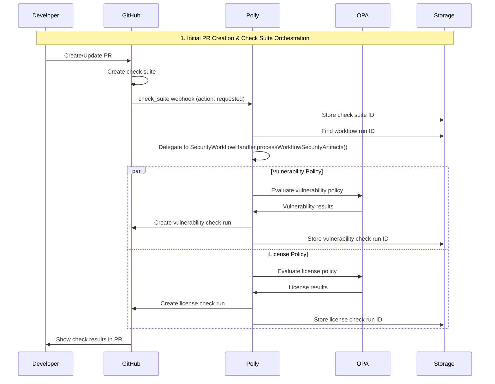
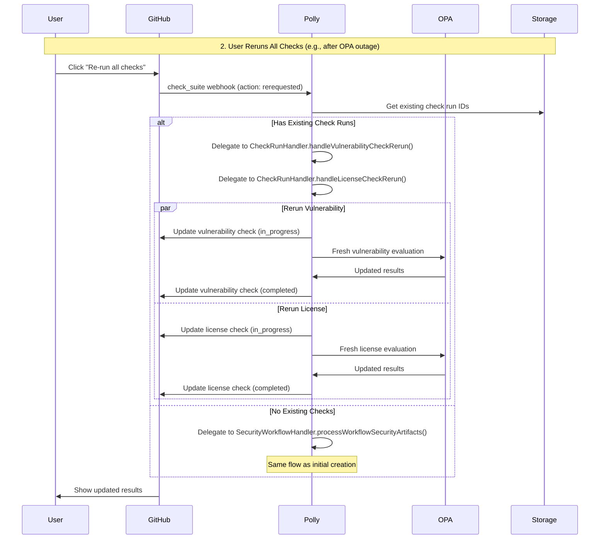
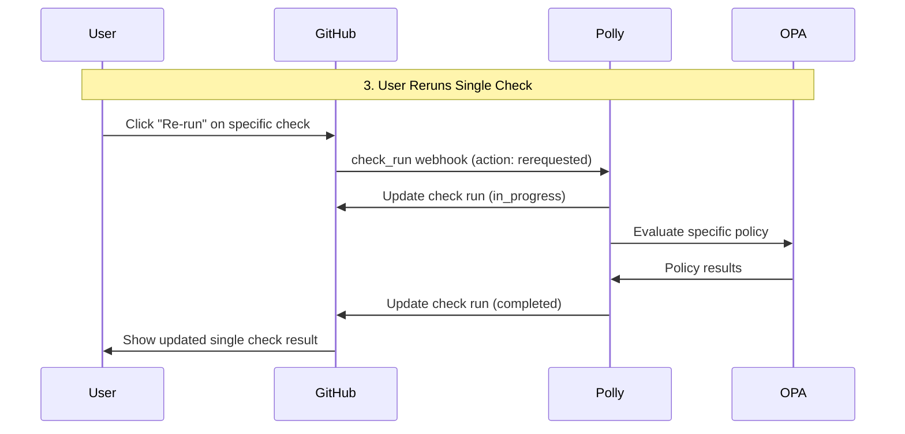
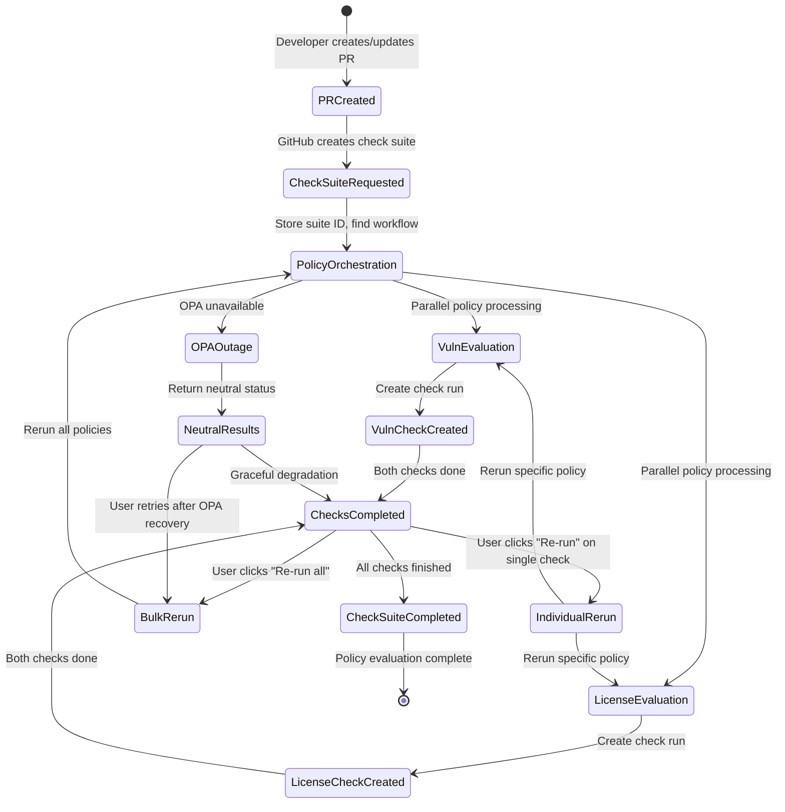

# Check Suite Webhook Implementation Guide

## Overview

This document outlines the implementation of GitHub `check_suite` webhook support in Polly to orchestrate policy evaluations and enable users to retry checks when needed. The check suite acts as the primary coordinator for all policy checks within a commit.

## Problem Statement

The current architecture has two main issues:

1. **OPA Outage Recovery**: When OPA (Open Policy Agent) is unavailable, Polly correctly returns "neutral" check conclusions instead of false policy failures. However, users had no clear way to retry policy evaluation once OPA came back online, leading to poor user experience during system recovery.

2. **Check Run Orchestration**: Policy checks are currently triggered independently via workflow webhooks, missing the proper GitHub check suite lifecycle that should coordinate all checks for a commit.

## Solution Architecture

### Core Components

```
GitHub UI "Re-run checks" → check_suite webhook (rerequested) → CheckSuiteWebhookHandler → Delegate to existing CheckRunHandler rerun logic
PR opened → GitHub creates check suite → check_suite(requested) → Delegate to existing SecurityWorkflowHandler processing
Check suite completed → Summary reporting (future enhancement)
```

### Key Files

- `internal/handlers/webhook_checksuite.go` - Main handler implementation
- `internal/handlers/webhook_checksuite_test.go` - Test suite
- `internal/handlers/webhook_router.go` - Router integration

## Implementation Details

### 1. Event Handler Structure

Following Polly's webhook handler pattern with code reuse:

```go
type CheckSuiteWebhookHandler struct {
    *SecurityWebhookHandler
    checkRunHandler *CheckRunHandler
}
```

This approach leverages existing handlers to avoid code duplication while providing check suite orchestration. It now also includes an optimized rerun path that pre-processes workflow artifacts once (if a completed workflow run is known) and restarts both checks using the shared payloads, falling back to individual rerun handlers only when necessary.

### 2. Supported Actions

| Action | Trigger | Behavior |
|--------|---------|----------|
| `requested` | GitHub creates check suite (PR/push) | Orchestrate all policies for new commits |
| `rerequested` | User clicks "Re-run all checks" OR "Re-run failed checks" | Re-evaluate existing policies or create new ones |
| `completed` | All checks in suite finish | Log completion (future: summary) |

### 3. Code Reuse & Optimization Strategy

The implementation leverages existing handlers to avoid duplication:

1. **Workflow Processing**: Delegates to existing `SecurityWebhookHandler.processWorkflowSecurityArtifacts()`
2. **Check Run Reruns**: Attempts optimized artifact prefetch path; falls back to `CheckRunHandler.handleVulnerabilityCheckRerun()` / `handleLicenseCheckRerun()` if workflow artifacts can't be retrieved
3. **State Management**: Reuses existing state service patterns with minimal additions
4. **Policy Processing**: Leverages existing `processVulnerabilityChecks()` and `processLicenseChecks()` functions

This approach reduces implementation complexity from an initially projected ~400 lines to a lean implementation while also preventing duplicate artifact processing during bulk reruns.

## Data Flow

### Complete Policy Check Lifecycle



### Bulk Rerun Flow (Check Suite)



### Individual Check Rerun Flow



### Complete Lifecycle State Diagram



## Code Structure

### Handler Implementation

```go
func (h *CheckSuiteWebhookHandler) HandleCheckSuite(ctx context.Context, event github.CheckSuitePayload) error {
    switch event.Action {
    case "requested":
        return h.handleCheckSuiteRequested(ctx, event)
    case "rerequested":
        return h.handleCheckSuiteRerequested(ctx, event)
    case "completed":
        return h.handleCheckSuiteCompleted(ctx, event)
    default:
        // Ignore other actions
        return nil
    }
}
```

### Code Reuse Implementation (Current)

```go
// NewCheckSuiteWebhookHandler leverages existing handlers
func NewCheckSuiteWebhookHandler(base *BaseWebhookHandler) *CheckSuiteWebhookHandler {
    return &CheckSuiteWebhookHandler{
        SecurityWebhookHandler: NewSecurityWebhookHandler(base),
        checkRunHandler:        NewCheckRunHandler(base),
    }
}

// handleCheckSuiteRequested processes initial check suite creation (from PR/push)
func (h *CheckSuiteWebhookHandler) handleCheckSuiteRequested(ctx context.Context, event github.CheckSuitePayload) error {
    owner, repo, sha, id := getEventInfo(event)

    // Store check suite ID as the primary coordinator
    if err := h.stateService.StoreCheckSuiteID(ctx, owner, repo, sha, id); err != nil {
        h.logger.WarnContext(ctx, "Failed to store check suite ID", "error", err)
    }

    // Delegate to existing security workflow processing
    return h.processSecurityWorkflow(ctx, owner, repo, sha)
}

// handleCheckSuiteRerequested processes check suite reruns
func (h *CheckSuiteWebhookHandler) handleCheckSuiteRerequested(ctx context.Context, event github.CheckSuitePayload) error {
    owner, repo, sha, id := getEventInfo(event)

    // Check for existing check runs and delegate to existing rerun logic
    return h.rerunExistingChecks(ctx, owner, repo, sha)
}

// processSecurityWorkflow delegates to existing security workflow processing
func (h *CheckSuiteWebhookHandler) processSecurityWorkflow(ctx context.Context, owner, repo, sha string) error {
    // Find associated workflow (same logic as existing handlers)
    workflowID, found, err := h.stateService.GetWorkflowRunID(ctx, owner, repo, sha)
    if err != nil || !found {
        return nil // Not an error - might be for other apps
    }

    // Delegate to existing security workflow handler
    config := WebhookProcessingConfig{
        Owner:         owner,
        Repo:          repo,
        SHA:           sha,
        WorkflowRunID: workflowID,
        CheckVuln:     true,
        CheckLicense:  true,
    }

    return h.processWorkflowSecurityArtifacts(ctx, config)
}

```go
// Optimized rerun structure (simplified – actual code includes logging & telemetry):
func (h *CheckSuiteWebhookHandler) rerunExistingChecks(ctx context.Context, owner, repo, sha string) error {
    vulnID, hasVuln, licenseID, hasLicense := h.getExistingCheckRunIDs(ctx, owner, repo, sha)
    if !hasVuln && !hasLicense { // treat as new orchestration
        return h.processSecurityWorkflow(ctx, owner, repo, sha)
    }
    // Try optimized artifact prefetch path
    if h.tryRerunWithPrefetchedArtifacts(ctx, owner, repo, sha, vulnID, hasVuln, licenseID, hasLicense) {
        return nil
    }
    // Fallback to individual reruns
    return h.fallbackReruns(ctx, owner, repo, sha, vulnID, hasVuln, licenseID, hasLicense)
}
```

### Re-run Logic (Updated)

1. `getExistingCheckRunIDs()` – safe retrieval with error logging
2. `tryRerunWithPrefetchedArtifacts()` – single artifact processing + restart of both checks if possible
3. `fallbackReruns()` – delegates to individual `CheckRunHandler` rerun methods when workflow/artifacts unavailable

## Check Run vs Check Suite Coordination

### Individual Check Run Reruns
Single check runs can still be individually rerun through the existing check run webhook handlers:

```go
// CheckRunHandler continues to handle individual check reruns independently
func (h *CheckRunHandler) handleVulnerabilityCheckRerun(ctx context.Context, owner, repo, sha string, checkRunID int64) error {
    // Existing sophisticated rerun logic:
    // 1. Store check run ID
    // 2. Start check run (in_progress)
    // 3. Process stored artifacts via SecurityService.ProcessWorkflowSecurityArtifacts()
    // 4. Evaluate policies via processVulnerabilityChecks()
    // 5. Update check run with results
    return h.restartVulnerabilityCheck(ctx, owner, repo, sha, checkRunID)
}
```

### Code Reuse & Optimization Benefits

- ✅ **Zero Duplication**: Delegates to existing rerun handlers when optimized path not available
- ✅ **Single Artifact Processing**: Prefetches workflow artifacts once for both checks
- ✅ **Existing Logic**: Reuses sophisticated artifact processing, policy evaluation, and check run management
- ✅ **Minimal Implementation**: ~100 lines vs ~400+ lines of duplicated code
- ✅ **Consistent Behavior**: Same rerun logic whether triggered by check_suite or check_run webhooks

### Coordination Pattern

| User Action | Event Type | Handler | Behavior |
|-------------|-----------|---------|----------|
| Click "Re-run" on individual check | `check_run` | `CheckRunHandler.handleVulnerabilityCheckRerun()` | Rerun single policy check |
| Click "Re-run all checks" | `check_suite` | `CheckSuiteWebhookHandler` → delegates to `CheckRunHandler` | Rerun all policy checks |
| Click "Re-run failed checks" | `check_suite` | `CheckSuiteWebhookHandler` → delegates to `CheckRunHandler` | Rerun only failed policy checks |

### Benefits of Dual Approach

- ✅ **Granular Control**: Users can rerun individual policy checks (e.g., just vulnerability scan)
- ✅ **Bulk Operations**: Users can rerun all checks at once via check suite
- ✅ **GitHub Native UX**: Both approaches use GitHub's built-in rerun buttons
- ✅ **No Interference**: Each approach handles its specific use case without conflicts
- ✅ **Code Reuse**: Check suite handler delegates to existing check run rerun logic
- ✅ **Consistent Behavior**: Same underlying logic whether triggered individually or in bulk

## Testing Strategy

### Test Structure

Following Polly's testing patterns with testify suites:

```go
type CheckSuiteWebhookTestSuite struct {
    WebhookTestSuite
    handler *CheckSuiteWebhookHandler
}
```

## Deduplication Policy

Check suite events do not create check runs. Creation is handled primarily by `pull_request` events. The `workflow_run` handler marks existing checks as in_progress when a run starts and processes artifacts on completion. On `check_suite.rerequested`, the handler re-runs existing checks by looking up stored IDs in `StateService`, ensuring a single source of truth and avoiding duplicates.
```

### Test Coverage

- ✅ Handle `requested` action with existing workflow (initial check suite creation)
- ✅ Handle `requested` action for rerun scenarios
- ✅ Handle `rerequested` action with existing check runs
- ✅ Handle `rerequested` action without existing check runs
- ✅ Handle `completed` action for summary logging
- ✅ Ignore unknown actions
- ✅ Handle missing workflow gracefully
- ✅ Test check suite orchestration vs individual check run reruns
- ✅ Test coordination between check suite and individual check run events
- ✅ Integration with mock services

### Test Data

```go
const (
    testCheckSuiteEventJSON = `{
        "action": "requested",
        "check_suite": {
            "id": 123456789,
            "head_sha": "test-sha-123"
        },
        "repository": {
            "name": "test-repo",
            "owner": {
                "login": "test-owner"
            }
        }
    }`
)
```

## Integration Points

### 1. Webhook Router Updates

```go
// internal/handlers/webhook.go
func (h *WebhookHandler) HandleWebhook(ctx context.Context, eventType string, payload []byte) error {
    switch eventType {
    case "check_suite":
        return h.handleCheckSuiteEvent(ctx, payload)
    // ... other cases
    }
}
```

### 2. Dependency Injection

```go
// internal/app/container.go
func (c *Container) buildCheckSuiteWebhookHandler() *handlers.CheckSuiteWebhookHandler {
    return handlers.NewCheckSuiteWebhookHandler(c.buildBaseWebhookHandler())
}

// Leverages existing container pattern - no additional dependencies needed
```

### 3. State Service Extension

Add methods to store and retrieve check suite IDs:

```go
// Add new state key for check suites
const (
    // ... existing keys
    StateKeyCheckSuite StateKeyType = "check_suite"
)

// Update StateMap to include check suite tracking
type StateMap struct {
    // ... existing fields
    CheckSuiteID          int64
    HasCheckSuite         bool
}

// Store check suite ID when webhook is received
func (s *StateService) StoreCheckSuiteID(ctx context.Context, owner, repo, sha string, suiteID int64) error {
    repoCtx := RepoContext{Owner: owner, Repo: repo, SHA: sha}
    return s.storeInt64(ctx, StateKeyCheckSuite, repoCtx, suiteID)
}

// Retrieve check suite ID for re-run operations
func (s *StateService) GetCheckSuiteID(ctx context.Context, owner, repo, sha string) (int64, bool, error) {
    repoCtx := RepoContext{Owner: owner, Repo: repo, SHA: sha}
    return s.getInt64(ctx, StateKeyCheckSuite, repoCtx)
}

// GetWorkflowRunID() method already exists in StateService:
func (s *StateService) GetWorkflowRunID(ctx context.Context, owner, repo, sha string) (int64, bool, error) {
    repoCtx := RepoContext{Owner: owner, Repo: repo, SHA: sha}
    return s.getInt64(ctx, StateKeyWorkflow, repoCtx)
}
```

## Storage Requirements

### Check Suite Lifecycle Management

The check suite implementation requires storing the relationship between check suites and their associated workflows:

**Key Storage Pattern:**
```
"owner:repo:check_suite:sha" → check_suite_id
"owner:repo:workflow:sha" → workflow_run_id
```

**Storage Flow:**
1. `check_suite` webhook received → Store suite ID for SHA
2. User clicks "Re-run" → Retrieve suite ID and workflow ID
3. Policy evaluation → Update check runs within the suite
4. `check_suite` completed → Optional cleanup/summary

### State Key Benefits

- **Audit Trail**: Track which check suites triggered policy re-runs
- **Debugging**: Link policy failures to specific check suite events
- **Future Enhancements**: Enable selective re-runs or summary reporting
- **Consistency**: Follow existing state service patterns

## Architecture Benefits

### 1. **Clear Ownership Model**
- ✅ Check Suite is the **primary coordinator** for all policy checks
- ✅ Individual check runs are **managed entities** under the suite
- ✅ State management flows from suite → check runs

### 2. **Proper GitHub Integration**
- ✅ Follows GitHub's intended check suite lifecycle
- ✅ "Re-run all checks" button works as expected
- ✅ Check suite status reflects aggregate check run status

### 3. **Event Flow Coordination**
```
PR opened → GitHub creates check suite → check_suite(requested) → Orchestrate all checks
User clicks "Re-run" → check_suite(rerequested) → Rerun existing checks
All checks done → check_suite(completed) → Summary reporting
```

### 4. **Interference Prevention**
- ✅ Avoids duplicate policy evaluations when both suite and individual check events occur
- ✅ Reuses existing check runs for reruns instead of creating duplicates
- ✅ Clear distinction between initial orchestration vs reruns
- ✅ **Dual Rerun Support**: Both individual check reruns AND bulk check suite reruns work harmoniously

## User Experience

### Before Implementation

1. **Policy Orchestration**: Workflow webhooks trigger individual policy checks independently
2. **OPA Outages**: Checks show "neutral" → No clear retry mechanism
3. **User Experience**: Users must wait for new commits or manual intervention
4. **Check Suite Disconnect**: Check suites exist but don't coordinate policy checks

### After Implementation

1. **Policy Orchestration**: Check suites coordinate all policy checks for a commit
2. **OPA Recovery**: User clicks "Re-run all checks" → Fresh policy evaluation
3. **Granular Control**: User clicks "Re-run" on individual check → Single policy rerun
4. **User Experience**: Immediate retry capability with both bulk and individual options
5. **Check Suite Integration**: Check suites manage complete policy evaluation lifecycle

## Observability

### Logging

All operations include structured logging with context:

```go
h.logger.InfoContext(ctx, "Processing check suite event",
    "action", *event.Action,
    "owner", event.Repo.Owner.GetLogin(),
    "repo", event.Repo.GetName(),
    "sha", event.CheckSuite.GetHeadSHA(),
)
```

### Telemetry

OpenTelemetry spans (via `TelemetryHelper`) track each public method:
`webhook.handle_check_suite`, `webhook.handle_check_suite_requested`, `webhook.handle_check_suite_rerequested`, `webhook.handle_check_suite_completed`.

Errors are recorded uniformly with `telemetry.SetErrorAttribute(span, err)` eliminating inconsistent log-only error reporting.

## Error Handling

### Graceful Degradation

- Missing workflow for SHA → Log warning, continue (not an error)
- Invalid event format → Return error
- Service failures → Return error with context

### Error Patterns

```go
if err != nil {
    h.logger.WarnContext(ctx, "No workflow found for check suite rerun",
        "owner", owner, "repo", repo, "sha", sha, "error", err)
    return nil // Not an error - might be for other apps
}
```

## Performance Considerations

### Efficiency

- ✅ Reuses existing check run processing logic (`CheckRunHandler`)
- ✅ Reuses existing security workflow processing (`SecurityWebhookHandler`)
- ✅ No additional caching layer required
- ✅ Leverages existing OpenTelemetry instrumentation
- ✅ **Minimal Code**: ~100 lines vs ~400+ lines of duplicated functionality

### Scalability

- ✅ Stateless handler design
- ✅ Uses existing service dependency graph
- ✅ No new external dependencies

## Future Enhancements

### Phase 1 (Current)
- Check suite orchestration for policy check lifecycle
- Basic `requested`/`rerequested` support
- Integration with existing policy processing
- Prevention of check run interference

### Phase 2 (Future)
- Selective re-runs based on check types or failure reasons
- Rich summary reporting on check suite completion
- Integration with notification systems for policy compliance
- Batch processing optimizations for large repositories
- Cross-repository policy coordination for monorepos

## Deployment Considerations

### Configuration

No new configuration required - uses existing webhook and service configuration.

### Rollout Strategy

1. Deploy with feature flag (if needed)
2. Monitor webhook event processing
3. Validate user experience improvements
4. Full rollout

### Monitoring

Watch for:
- Check suite event processing latency
- Policy evaluation retry success rates
- User adoption of re-run functionality

## Related Documentation

- [ADR-007: Webhook Handler Refactoring Consolidation](ADR-007-webhook-handler-refactoring-consolidation.md)
- [ADR-008: Policy Processing Strategy Pattern](ADR-008-policy-processing-strategy-pattern.md)
- [Webhook Development Guide](WEBHOOK_DEVELOPMENT_GUIDE.md)
- [Policy Cache Implementation](POLICY_CACHE_IMPLEMENTATION.md)

## Decision Record

This implementation was chosen because:

1. **GitHub Native Architecture**: Aligns with GitHub's intended check suite lifecycle for coordinating checks
2. **Solves Multiple Problems**: Addresses both OPA outage recovery and proper check orchestration
3. **Minimal Code Duplication**: Leverages existing `CheckRunHandler` and `SecurityWebhookHandler` logic
4. **High Value**: Provides complete policy check lifecycle management with minimal implementation
5. **Standard Integration**: Uses GitHub's native re-run mechanism and check suite events
6. **Maintainable**: Follows established project patterns with clear delegation to existing handlers
7. **Testable**: Clear interface boundaries and existing mocking strategies can be reused
8. **Future-Proof**: Foundation for advanced features while maintaining simplicity

The combination of check suite orchestration with code reuse provides complete resilience for OPA outages while establishing proper policy check lifecycle management that aligns with GitHub's architecture without duplicating existing functionality.
