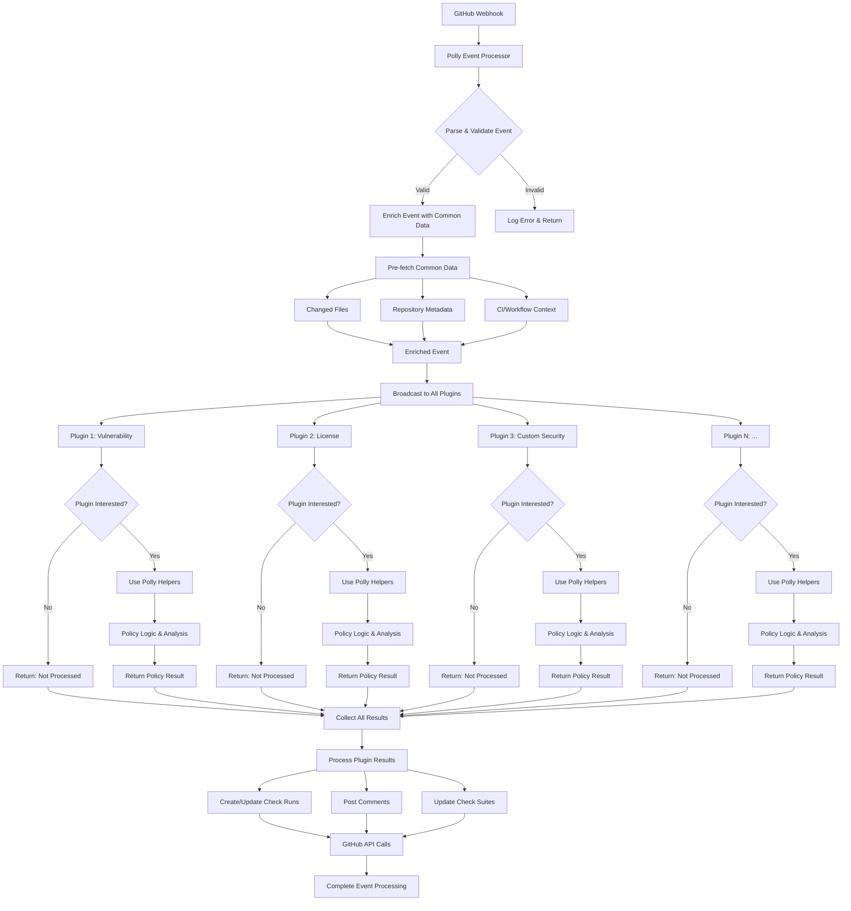
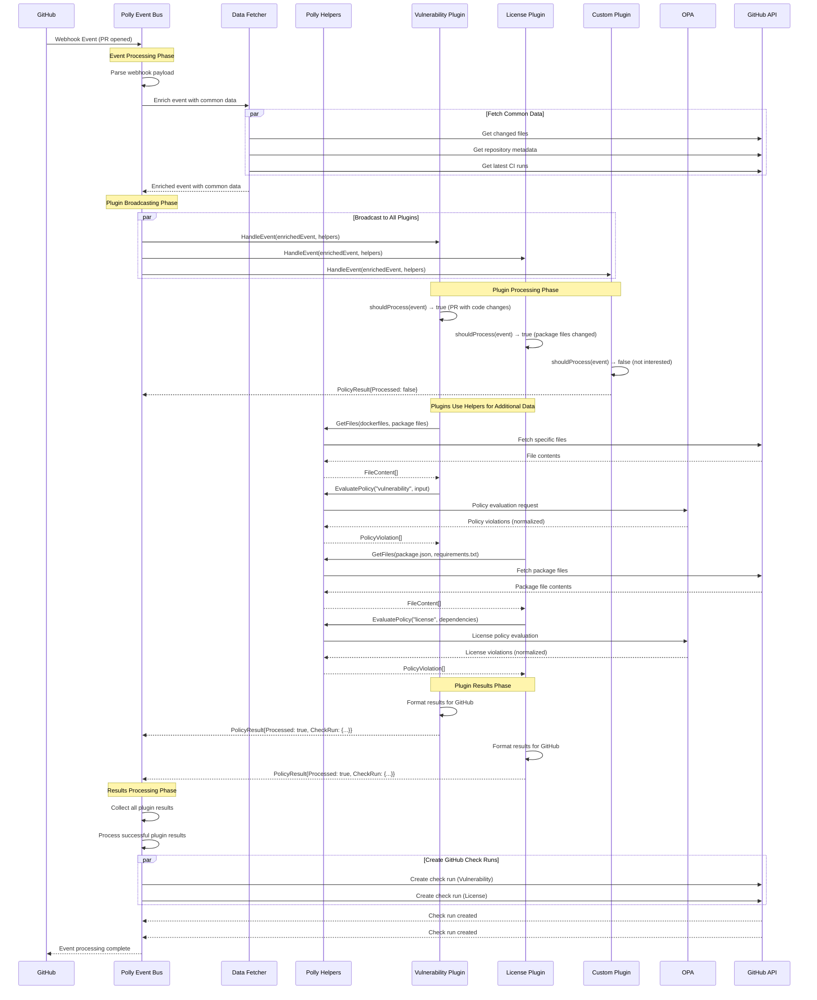
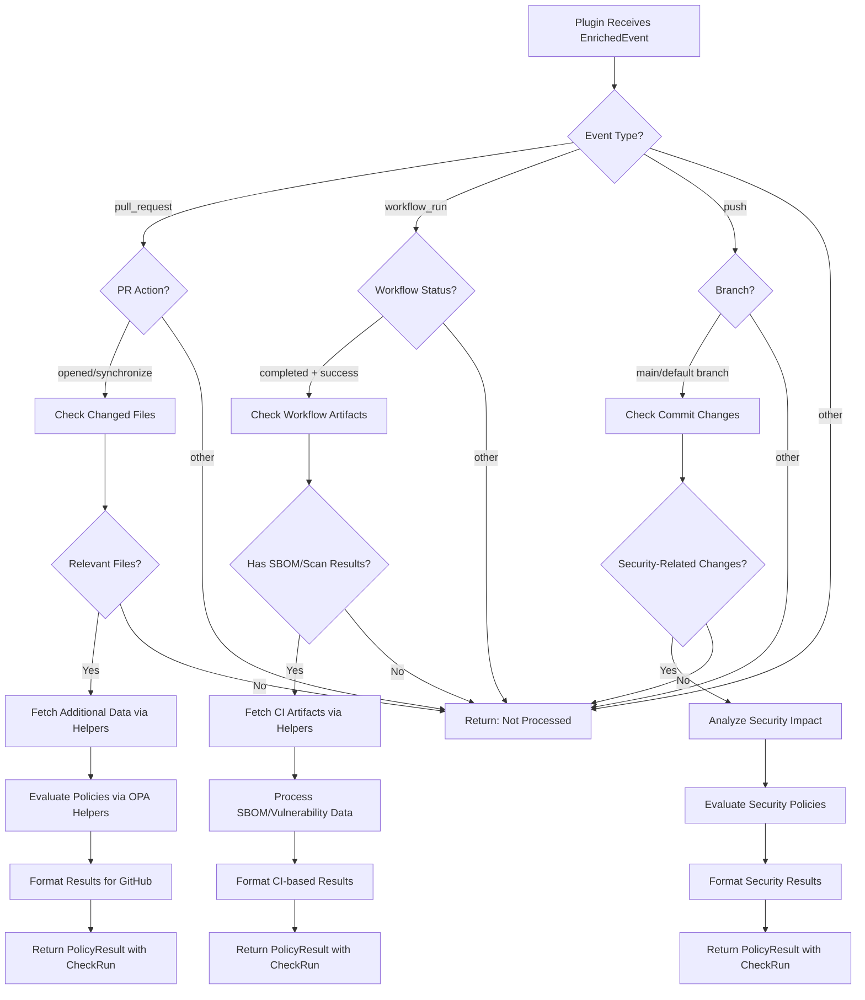
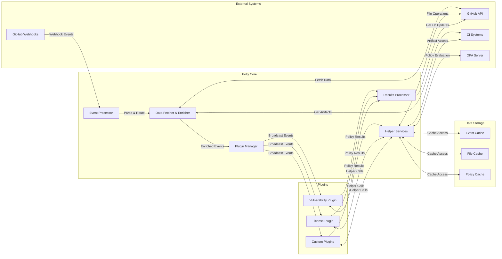
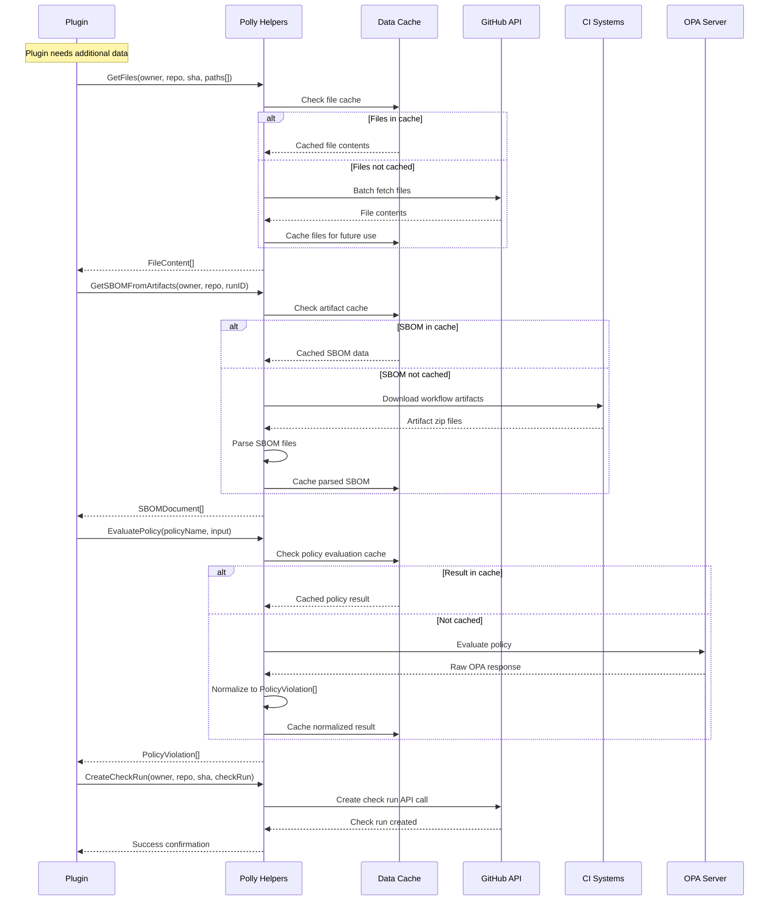
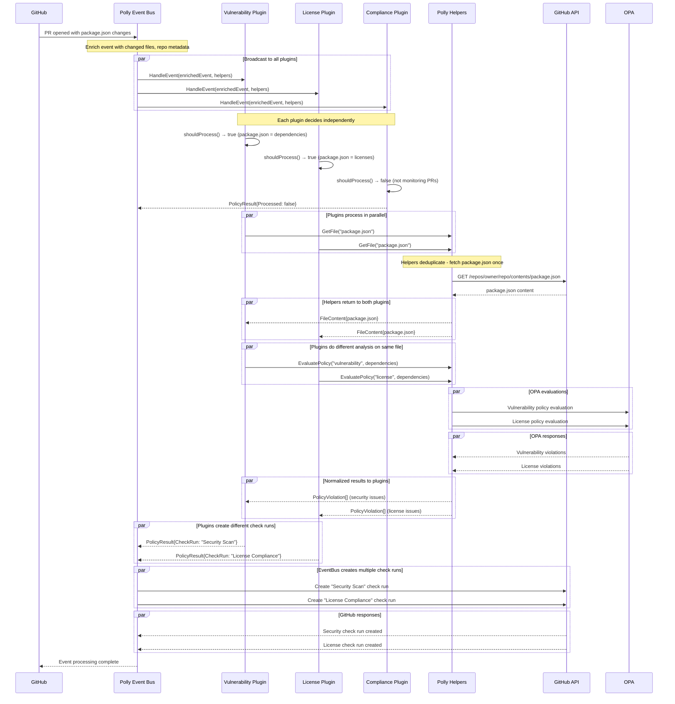
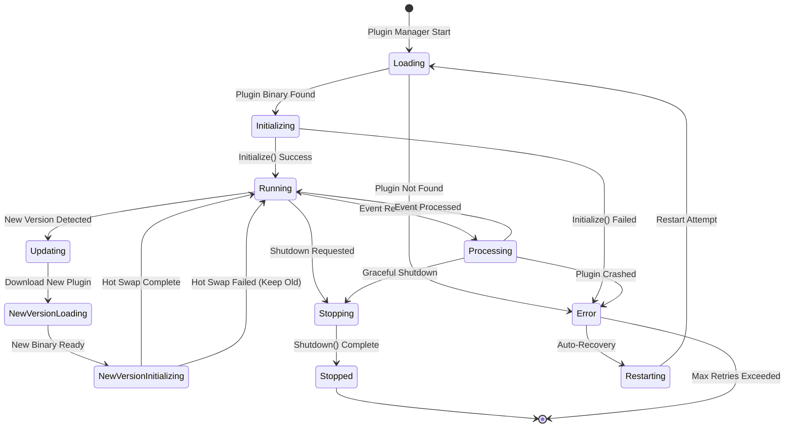

<!-- Moved from docs/event-bus-architecture.md -->
<!-- Technical architecture guide for Polly 2.0 event bus system. -->
# Event Bus Plugin Architecture

## Architecture: Polly as Event Bus/Router with Helper Services

This approach treats Polly as an intelligent event bus that enriches GitHub webhooks and provides helper services for common tasks, while plugins decide autonomously what events to process.

## Architecture Diagrams

### High-Level Architecture Flowchart



### Event Processing Sequence Diagram



### Plugin Decision Flow



### Data Flow Architecture



### Helper Services Interaction Flow



### Multi-Plugin Event Processing



### Plugin Lifecycle and Hot Reload



## Core Architecture

```
GitHub Webhook → Polly Event Processor → Enriched Event → All Plugins
                                                     ↓
                Plugin Filters Event → Uses Polly Helpers → Returns Result
```

## Benefits

### Plugin Autonomy & Flexibility
- Plugins decide what events they care about (not Polly)
- Same plugin can handle multiple event types
- Easy to add new event types without changing plugin interface
- Plugins can implement complex business logic across events

### Extensibility & Future-Proofing
- New plugins automatically get all events
- Plugins can evolve to handle new event types
- Cross-cutting concerns (security, compliance) can listen to any event
- Event-driven architecture enables complex workflows

### Performance & Efficiency
- Polly fetches common data once, broadcasts to all interested plugins
- Plugins filter events efficiently at the RPC boundary
- No complex routing logic in Polly core
- Lazy loading - plugins only fetch additional data they need

## Plugin Interface Design

```go
// Event bus interface - all plugins receive all events
type PolicyPlugin interface {
    // Metadata
    Name() string
    Version() string
    
    // Event handling - plugin decides what to process
    HandleEvent(ctx context.Context, event EnrichedEvent, helpers PollyHelpers) (*PolicyResult, error)
    
    // Lifecycle management
    Initialize(config PluginConfig) error
    Shutdown() error
    Health() error
}

// Enriched event with common data pre-fetched by Polly
type EnrichedEvent struct {
    // Original GitHub webhook data
    Type        string          `json:"type"`         // "pull_request", "workflow_run", "push", etc.
    Action      string          `json:"action"`       // "opened", "synchronize", "completed", etc.
    Repository  Repository      `json:"repository"`
    Sender      User            `json:"sender"`
    
    // Context information
    PullRequest *PullRequest    `json:"pull_request,omitempty"`
    WorkflowRun *WorkflowRun    `json:"workflow_run,omitempty"`
    Commit      *Commit         `json:"commit,omitempty"`
    
    // Pre-fetched common data (Polly fetches proactively)
    CommonData  CommonEventData `json:"common_data"`
    
    // Polly-added metadata
    EventID     string          `json:"event_id"`     // Unique event identifier
    Timestamp   time.Time       `json:"timestamp"`
    ProcessedAt time.Time       `json:"processed_at"`
}

// Common data Polly fetches for most events
type CommonEventData struct {
    // Changed files (for PR/push events)
    ChangedFiles    []ChangedFile   `json:"changed_files,omitempty"`
    
    // Basic repository info
    DefaultBranch   string          `json:"default_branch"`
    Languages       []string        `json:"languages,omitempty"`
    Topics          []string        `json:"topics,omitempty"`
    
    // CI/CD context (if available)
    LatestWorkflow  *WorkflowRun    `json:"latest_workflow,omitempty"`
    CheckSuites     []CheckSuite    `json:"check_suites,omitempty"`
}

// Helper services provided by Polly to plugins
type PollyHelpers interface {
    // File operations
    GetFile(ctx context.Context, owner, repo, sha, path string) (*FileContent, error)
    GetFiles(ctx context.Context, owner, repo, sha string, paths []string) ([]FileContent, error)
    GetDirectoryContents(ctx context.Context, owner, repo, sha, path string) ([]FileInfo, error)
    
    // Diff operations  
    GetPullRequestDiff(ctx context.Context, owner, repo string, prNumber int) (*Diff, error)
    GetCommitDiff(ctx context.Context, owner, repo, sha string) (*Diff, error)
    
    // CI/Artifact operations
    GetWorkflowArtifacts(ctx context.Context, owner, repo string, runID int64) ([]Artifact, error)
    DownloadArtifact(ctx context.Context, owner, repo string, artifactID int64) ([]byte, error)
    GetCheckRuns(ctx context.Context, owner, repo, sha string) ([]CheckRun, error)
    
    // SBOM/Security data
    GetSBOMFromArtifacts(ctx context.Context, owner, repo string, runID int64) ([]SBOMDocument, error)
    GetVulnerabilityScans(ctx context.Context, owner, repo string, runID int64) ([]VulnScanResult, error)
    
    // OPA evaluation
    EvaluatePolicy(ctx context.Context, policyName string, input interface{}) ([]PolicyViolation, error)
    
    // GitHub operations
    CreateCheckRun(ctx context.Context, owner, repo, sha string, check CheckRunRequest) error
    UpdateCheckRun(ctx context.Context, owner, repo string, checkRunID int64, update CheckRunUpdate) error
    CreateComment(ctx context.Context, owner, repo string, prNumber int, comment string) error
}

// Plugin result - what plugins return
type PolicyResult struct {
    // Did this plugin process the event?
    Processed   bool                    `json:"processed"`
    
    // Policy violations found (if any)
    Violations  []PolicyViolation       `json:"violations,omitempty"`
    
    // GitHub check run to create/update
    CheckRun    *CheckRunRequest        `json:"check_run,omitempty"`
    
    // GitHub comment to post
    Comment     *CommentRequest         `json:"comment,omitempty"`
    
    // Additional metadata
    Summary     string                  `json:"summary,omitempty"`
    Details     map[string]interface{}  `json:"details,omitempty"`
}
```

## Plugin Implementation Examples

### Vulnerability Plugin
```go
func (p *VulnerabilityPlugin) HandleEvent(ctx context.Context, event EnrichedEvent, helpers PollyHelpers) (*PolicyResult, error) {
    // Plugin decides what events it cares about
    if !p.shouldProcess(event) {
        return &PolicyResult{Processed: false}, nil
    }
    
    var violations []PolicyViolation
    
    switch event.Type {
    case "workflow_run":
        if event.Action == "completed" && event.WorkflowRun.Conclusion == "success" {
            // Get SBOM data from completed workflow
            sboms, err := helpers.GetSBOMFromArtifacts(ctx, event.Repository.Owner, event.Repository.Name, event.WorkflowRun.ID)
            if err != nil {
                return nil, err
            }
            
            // Get vulnerability scan results
            vulnScans, err := helpers.GetVulnerabilityScans(ctx, event.Repository.Owner, event.Repository.Name, event.WorkflowRun.ID)
            if err != nil {
                return nil, err
            }
            
            // Process vulnerability data
            violations = p.processVulnerabilities(sboms, vulnScans)
        }
        
    case "pull_request":
        if event.Action == "opened" || event.Action == "synchronize" {
            // Check for vulnerable dependencies in changed files
            for _, file := range event.CommonData.ChangedFiles {
                if p.isPackageFile(file.Path) {
                    content, err := helpers.GetFile(ctx, event.Repository.Owner, event.Repository.Name, event.PullRequest.Head.SHA, file.Path)
                    if err != nil {
                        continue
                    }
                    
                    fileViolations := p.analyzePackageFile(content)
                    violations = append(violations, fileViolations...)
                }
            }
        }
    }
    
    if len(violations) == 0 {
        return &PolicyResult{Processed: true}, nil
    }
    
    return &PolicyResult{
        Processed: true,
        Violations: violations,
        CheckRun: &CheckRunRequest{
            Name:        "Vulnerability Scan",
            Status:      "completed",
            Conclusion:  p.determineConclusion(violations),
            Summary:     p.formatSummary(violations),
            Details:     p.formatDetails(violations),
        },
    }, nil
}

func (p *VulnerabilityPlugin) shouldProcess(event EnrichedEvent) bool {
    switch event.Type {
    case "workflow_run":
        return event.Action == "completed"
    case "pull_request":
        return event.Action == "opened" || event.Action == "synchronize"
    default:
        return false
    }
}
```

### License Compliance Plugin
```go
func (p *LicensePlugin) HandleEvent(ctx context.Context, event EnrichedEvent, helpers PollyHelpers) (*PolicyResult, error) {
    if !p.shouldProcess(event) {
        return &PolicyResult{Processed: false}, nil
    }
    
    // Same plugin can handle different events differently
    switch event.Type {
    case "pull_request":
        return p.handlePullRequest(ctx, event, helpers)
    case "push":
        return p.handlePush(ctx, event, helpers) 
    case "workflow_run":
        return p.handleWorkflowComplete(ctx, event, helpers)
    }
    
    return &PolicyResult{Processed: false}, nil
}

func (p *LicensePlugin) shouldProcess(event EnrichedEvent) bool {
    // License plugin cares about multiple event types
    switch event.Type {
    case "pull_request":
        return event.Action == "opened" || event.Action == "synchronize"
    case "push":
        return event.Repository.DefaultBranch == extractBranchFromRef(event.Commit.Ref)
    case "workflow_run":
        return event.Action == "completed" && event.WorkflowRun.Conclusion == "success"
    default:
        return false
    }
}
```

## Polly Event Processing Pipeline

```go
type EventProcessor struct {
    plugins []PolicyPlugin
    github  *github.Client
    helpers *HelperServices
}

func (ep *EventProcessor) ProcessWebhook(ctx context.Context, eventType string, payload []byte) error {
    // 1. Parse webhook into structured event
    event, err := ep.parseWebhookEvent(eventType, payload)
    if err != nil {
        return err
    }
    
    // 2. Enrich event with common data
    enrichedEvent, err := ep.enrichEvent(ctx, event)
    if err != nil {
        return err
    }
    
    // 3. Broadcast to ALL plugins
    var results []PolicyResult
    for _, plugin := range ep.plugins {
        result, err := plugin.HandleEvent(ctx, enrichedEvent, ep.helpers)
        if err != nil {
            log.Errorf("Plugin %s failed: %v", plugin.Name(), err)
            continue
        }
        
        if result != nil && result.Processed {
            results = append(results, *result)
        }
    }
    
    // 4. Process plugin results (create check runs, comments, etc.)
    return ep.processResults(ctx, enrichedEvent, results)
}

func (ep *EventProcessor) enrichEvent(ctx context.Context, event *GitHubEvent) (*EnrichedEvent, error) {
    enriched := &EnrichedEvent{
        Type:        event.Type,
        Action:      event.Action,
        Repository:  event.Repository,
        EventID:     generateEventID(),
        Timestamp:   time.Now(),
        ProcessedAt: time.Now(),
    }
    
    // Pre-fetch common data based on event type
    switch event.Type {
    case "pull_request", "push":
        // Fetch changed files for code-related events
        changedFiles, err := ep.getChangedFiles(ctx, event)
        if err == nil {
            enriched.CommonData.ChangedFiles = changedFiles
        }
        
    case "workflow_run":
        // Fetch check suites for CI-related events
        checkSuites, err := ep.getCheckSuites(ctx, event)
        if err == nil {
            enriched.CommonData.CheckSuites = checkSuites
        }
    }
    
    return enriched, nil
}
```

## Benefits Summary

| Aspect | Targeted Plugin Calls | Event Bus Approach |
|--------|----------------------|-------------------|
| **Plugin Flexibility** | ❌ Polly decides what runs | ✅ Plugins decide what to process |
| **Event Handling** | ❌ Single event per plugin call | ✅ Plugin can handle multiple event types |
| **Future Events** | ❌ Need to update Polly routing | ✅ New events automatically available |
| **Cross-cutting Concerns** | ❌ Hard to implement | ✅ Easy (listen to all events) |
| **Plugin Autonomy** | ❌ Limited by Polly's routing | ✅ Full autonomy over business logic |
| **Development Speed** | ❌ Need to coordinate with Polly | ✅ Independent plugin development |

This event bus approach is **much more powerful and flexible** while maintaining the benefits of centralized data fetching and helper services!
